# Using the Maps app { #using_maps }
## About the Maps app { #about_maps }

The Maps app was introduced in release 2.29 as a replacement for the original GIS app, offering a
more intuitive and user-friendly interface. Since version 2.34, the mapping engine is based on WebGL
technology, capable of showing thousands of features on a map simultaneously.

> **Note**
>
> The Maps app requires WebGL. Visit [get.webgl.org](https://get.webgl.org) to verify that WebGL is
> working in your browser or to troubleshoot display issues.

With the Maps app, you can overlay multiple layers and choose from different basemaps. Supported
layer types include thematic maps, events, tracked entities, facilities, org unit boundaries, and
Earth Engine data such as population, elevation, or climate indicators. You can label features,
search and filter data, and save or share maps with other users, or download them as an image. Saved
maps can be added to dashboards in the **Dashboard** app. Thematic layers also integrate with the
**Data Visualizer** app, letting you open the same data as a chart.

> **Note**
>
> To use predefined legends in the **Maps** app, you need to create them first in the
> **Maintenance** app.

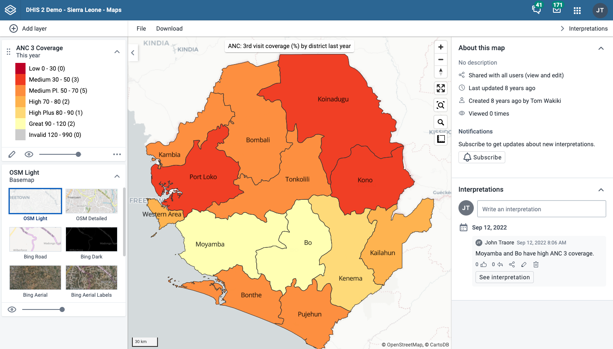

### Layers panel

The **layer panel** on the left side of the workspace shows an overview of the layers for the
current map:

-   As layers are added, using the **(+) Add layer** button, they are arranged and managed in this
    panel.

-   The **basemap** card is always shown at the bottom of the panel. See
    [Basemaps](#using_maps_basemaps) for available options.

-   The small arrow button to the right of the layer panel, at the top, allows the panel to be
    hidden or shown.

Each layer is represented by a card in the panel. Along the top of the card are a grab handle for
reordering layers with the mouse, the layer title, and an arrow to collapse or expand the card. The
middle of the card shows the layer legend where applicable. Along the bottom of the card from left
to right are:

-   An edit (pencil) button opens the layer configuration dialog.

-   An eye symbol toggles the visibility of the layer.

-   A slider modifies the layer transparency.

-   A more actions (three dots) button provides additional options, including showing or hiding the
    data table, downloading the layer data, and removing the layer.

### Map controls

-   The **+** and **-** buttons on the map allow you to zoom in and out of the map respectively. The
    mouse scroll wheel zoom is continuous, allowing you to fit the map perfectly to your content.

-   The **rotate map** button (triangle arrows) allows you to rotate and tilt the map to enhance the
    view of your data. Press and hold the button (or hold the Control key on your keyboard) while
    moving your mouse to change the map view. Click the button again to reset the view.

-   **Fullscreen** (four arrows) allows you to view the map in fullscreen. To exit fullscreen, click
    the button again or press the escape key on your keyboard.

-   **Zoom to content** (bounded magnifying glass symbol) automatically adjusts the zoom level and
    map center position to put the data on your map in focus.

-   **Search** (magnifying glass symbol) allows searching for and jumping to a location on the map.

-   The **ruler** button allows you to measure distances and areas on the map.

-   Right-click on the map to display the longitude and latitude of that location.

### File menu

-   The **File** button near the top left allows you to open and save maps. See
    [using the maps file menu](#using_maps_file_menu) for more detailed information.

-   The **Download** button next to the File button allows you to download the current map as a PNG
    image.

-   The **Interpretations** button at top right opens an interpretations panel on the right side of
    the workspace. See [viewing interpretations](#mapsInterpretation) for more information.
## Create a new map { #using_maps_create_map }

When you open the Maps app, you start with an empty map canvas and the default basemap selected. If
a map is already open, start a new one using **File** > **New**. You can change the basemap at any
time from the basemap card in the layer panel (see [Basemaps](#using_maps_basemaps)).

To add a layer, click the **(+) Add layer** button in the top left. The layer selection dialog
opens:

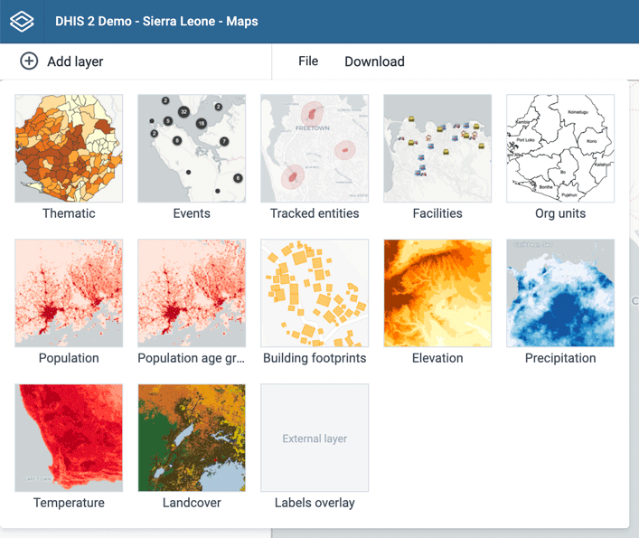

Available layer types are:

-   [**Thematic**](#using_maps_thematic_layer): Visualize data values (indicators or data elements)
    aggregated by org unit.
-   [**Events**](#using_maps_event_layer): Display individual events from event or tracker programs.
-   [**Tracked entities**](#using_maps_tracked_entity_layer): Display tracked entities and their
    relationships on the map.
-   [**Facilities**](#using_maps_facility_layer): Display facilities as icons based on their
    coordinates.
-   [**Org units**](#using_maps_org_unit_layer): Display org unit boundaries.

In addition, several layers may be provided by [Google Earth Engine](#using_maps_gee) (such as
population, elevation, or climate indicators) and
[other external services](#using_maps_external_map_layers). Various Google Earth Engine layer
sources are available if the Google Earth Engine API key has been set up (see
[documentation](https://docs.dhis2.org/en/use/user-guides/dhis-core-version-master/configuring-the-system/system-settings.html#system_server_settings:~:text=com/analytics.-,Google%20Maps%20API%20key,-Defines%20the%20API)).

> **Note**
>
> The [**Maps app administrator**](#maps_app_administrator) can:
>
> -   Select the sources for Google Earth Engine layers available to other users via the **Manage
>     available layer sources** button.
> -   Add external layer sources in the Maintenance app.
## Basemaps { #using_maps_basemaps }

A basemap provides the background map on which your data layers are displayed. You can select and
configure the basemap from the **basemap** card at the bottom of the layer panel.

The following basemaps are available by default:

-   **OSM Light**: A minimal, light-colored map based on OpenStreetMap data. This is the default
    basemap.
-   **OSM Detailed**: Contains more map features and place names.
-   **Sentinel-2 EOX**: Cloud-free satellite imagery showing natural-color views of the Earth's
    surface at 10m resolution.

If a Bing Maps or Azure Maps API key has been configured by a system administrator, four additional
basemaps become available from each provider. Both providers offer the same four styles, prefixed
with the provider name — for example, **Bing Road** and **Azure Road**:

-   **Road**: Shows roads, borders and places.
-   **Dark**: A dark-themed road map. Useful when the colors on your data layers are bright.
-   **Aerial**: Satellite and detailed aerial imagery.
-   **Aerial Labels**: Aerial imagery with place name labels.

A [**Maps app administrator**](#maps_app_administrator) can also add external basemaps via the
Maintenance app. These appear in the basemap card alongside the default basemaps.

Basemap layers are represented by a card in the layer panel. The card shows the list of available
basemaps with the current one highlighted. Controls at the bottom allow you to toggle the basemap
visibility and adjust its transparency.

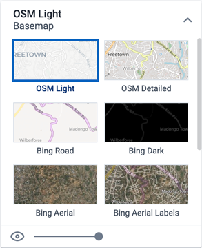

> **Note**
>
> Bing Maps is being retired. See the [Bing Maps Blog](https://aka.ms/BMERetirementAnnouncement) for
> the retirement announcement. For migration to Azure Maps, consult the
> [Bing Maps Migration Overview](https://learn.microsoft.com/azure/azure-maps/migrate-bing-maps-overview).
## Manage thematic layers { #using_maps_thematic_layer }

_Thematic maps_ represent spatial variation of geographic distributions. They display aggregated
data values for a selected data item (such as an indicator or data element), period and org unit
level. Org units with coordinates and matching data values will appear on the map.

> **Note**
>
> You must generate the DHIS2 analytics tables to have aggregated data values available.

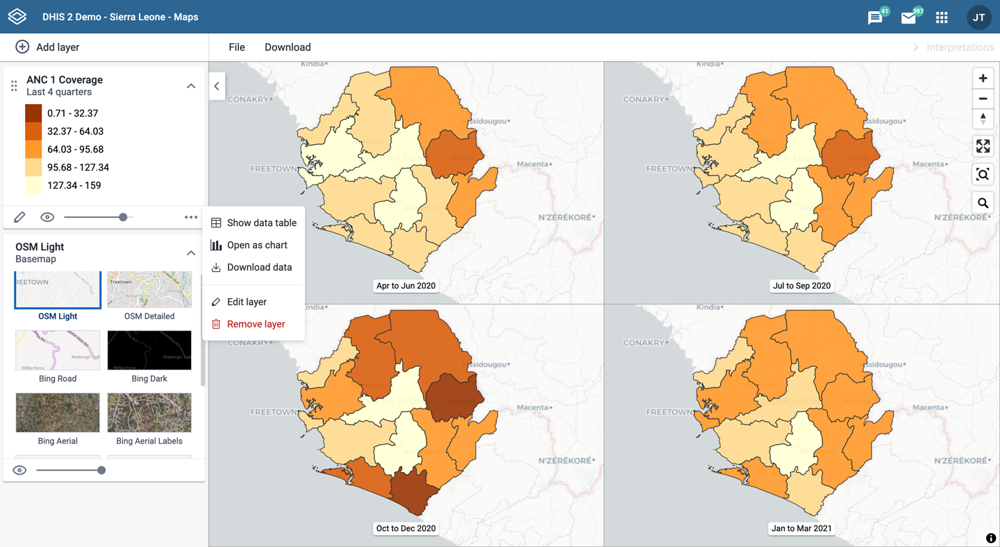

Thematic layers are represented by layer cards in the layer panel. The middle of the card shows a
legend indicating the value ranges displayed on the layer. The more actions (three dots) button
includes options to show or hide the data table, download the data, and open the data as a chart in
the Data Visualizer app via **Open as chart**.

### Create a thematic layer

To create a thematic layer, choose **Thematic** on the **Add layer** selection. This opens the
Thematic layer configuration dialog.

#### 1. Data

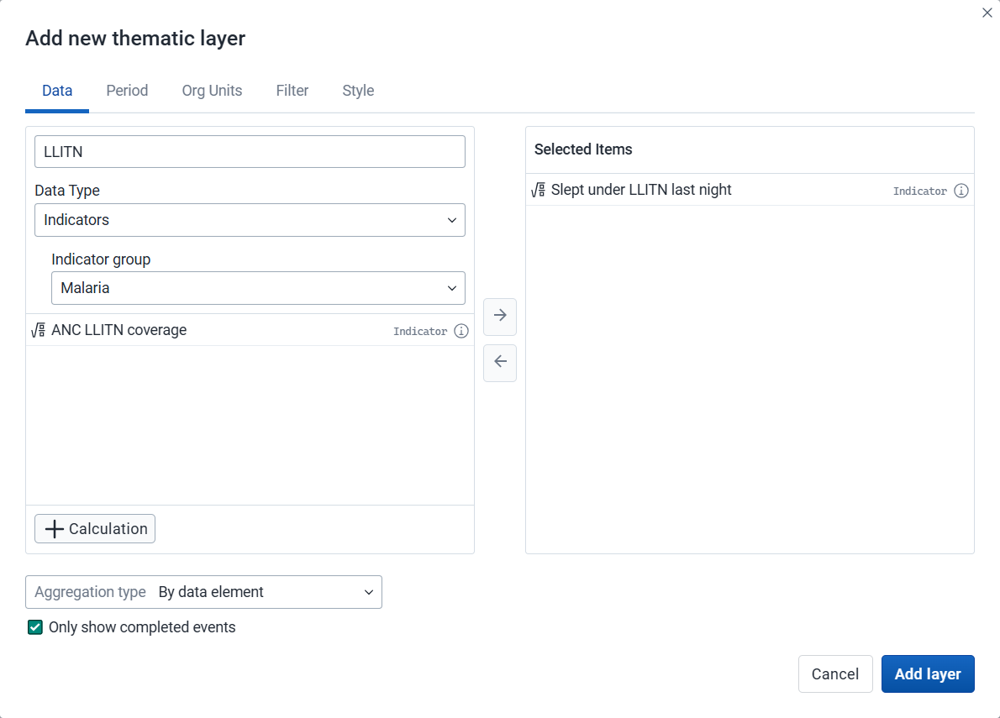

-   Select a data item.

-   Select a value from the **Aggregation type** field for the data values to be shown on the map.
    By default, "By data element" is selected. Alternative values are: Count, Average, Sum, Standard
    deviation, Variance, Min, Max. See also
    [Aggregation operators](https://docs.dhis2.org/en/use/user-guides/dhis-core-version-master/configuring-the-system/metadata.html#create_data_element:~:text=Aggregation%20operators).

-   **Only show completed events**: Includes only completed events in the aggregation process. This
    is useful when you want to exclude partial events in indicator calculations. Available for
    indicators, program indicators and event data items.

#### 2. Period

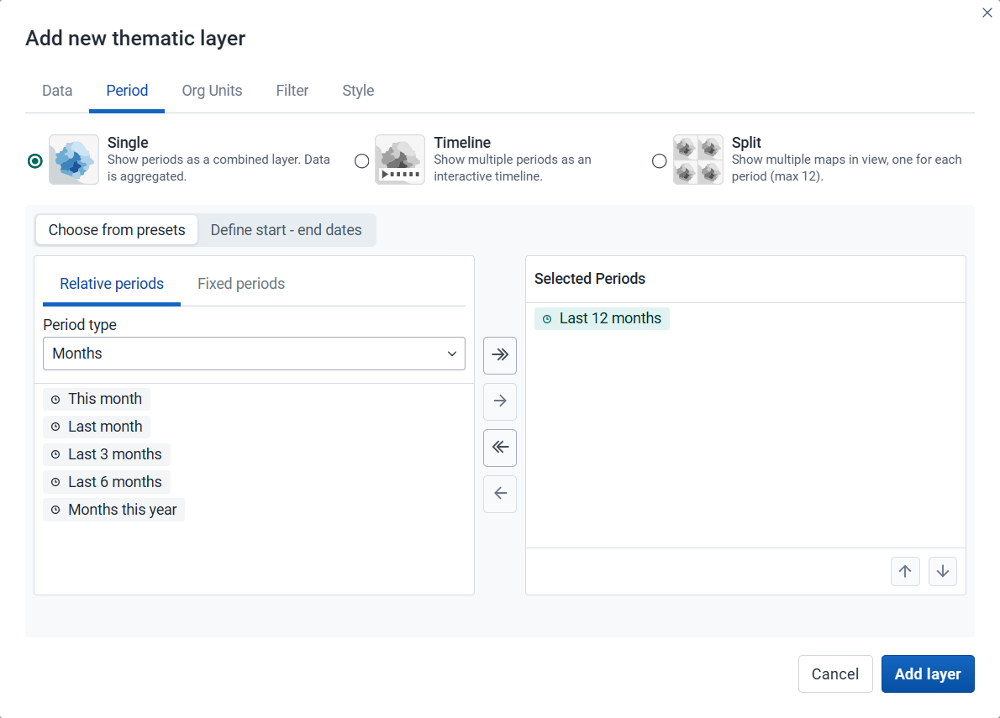

Select the time span over which the thematic data is mapped.

-   **Period display mode**: Select how the selected periods will be visualized on the map:

    -   _Single_ (default): Displays all selected periods as a single combined layer with aggregated
        data. Required when only one period is selected or when using start–end dates.

    -   _Timeline_: Displays multiple periods as an interactive timeline ordered chronologically.
        Multiple timeline layers can be added to a map (they will all share the same periods).

    -   _Split_: Displays multiple periods side by side for comparison. Supports up to 12 periods
        (including multi-period presets) and can only be combined with other split layers (they will
        all share the same periods).

-   After selecting a display mode, choose how to define the periods:

    -   **Choose from presets**: Available for all display modes. You can combine one or more
        relative and fixed periods.

        -   _Relative period_: Select **Relative periods**, then the **Period type** (**Years**,
            **Months**, etc.) and choose one or more relative periods, such as **This year** and
            **Last year** or **Last 12 months**. A **default relative period for analysis** can be
            set in the **System Settings** app.

        -   _Fixed period_: Select **Fixed periods**, then choose the **Period type** (**Yearly**,
            **Monthly**, etc.) and choose one or more fixed periods, such as **2024** or **January
            2025** and **February 2025**.

    -   **Define start–end dates**: Available only when the Single display mode is selected. Specify
        exact start and end dates. Both dates are inclusive and will be reflected in the outputs.

#### 3. Org units

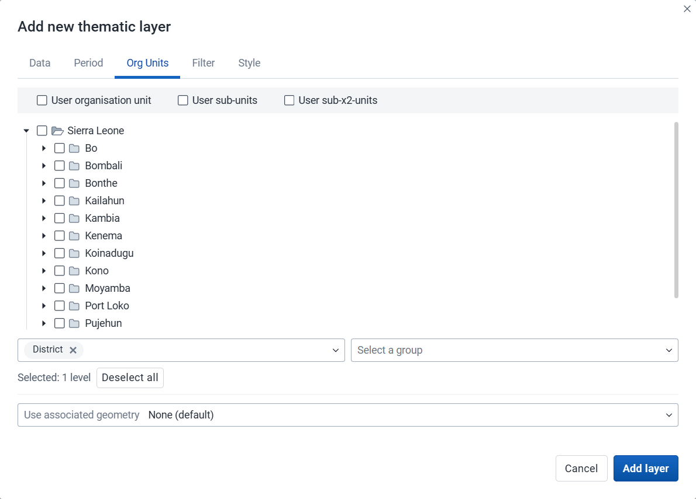

-   Select the org units you want to include in the layer. It is possible to select either

    -   One or more specific org units, org unit levels in the hierarchy, org unit groups, or

    -   A relative level in the org unit hierarchy, with respect to the user. By selecting a **User
        org unit** the map data will appear differently for users at different levels in the org
        unit hierarchy.

-   **Use associated geometry**: This dropdown will only show if there are any additional geometries
    available for your org units. This is typically used to show facility catchment areas.

#### 4. Filter

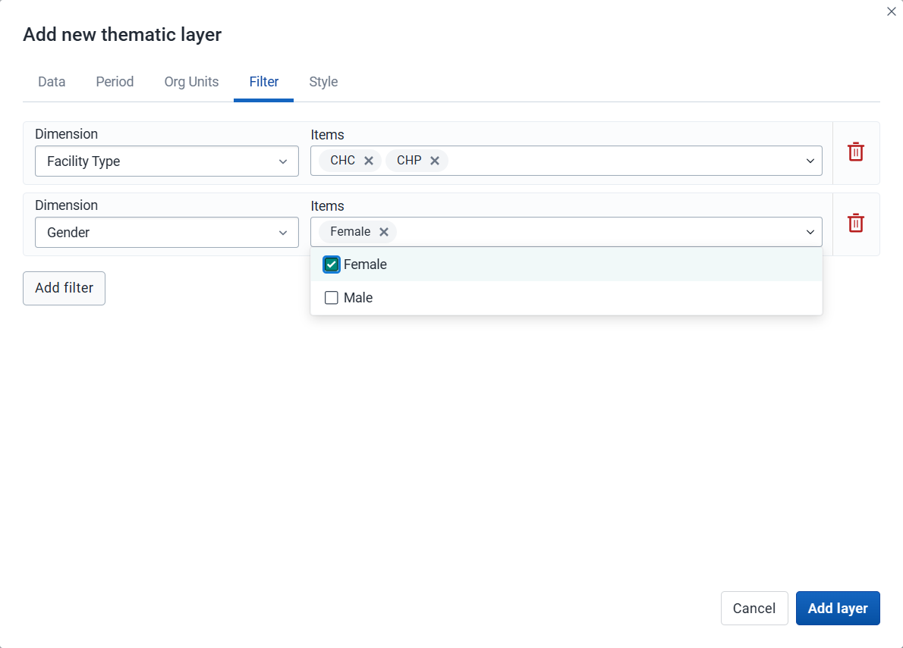

-   Click **Add filter** and select an available data item to add a new filter to the data set.

    -   Select a data dimension from the dropdown box. You can reduce the number of dimensions shown
        by using the search field. Click the name to select a dimension.

    -   When a dimension is selected you get a second dropdown with dimension items. Check the items
        you want to include in the filter.

    Multiple filters may be added. Click the trash button on the right of the filter to remove it.

#### 5. Style { #using_maps_thematic_layer_style }

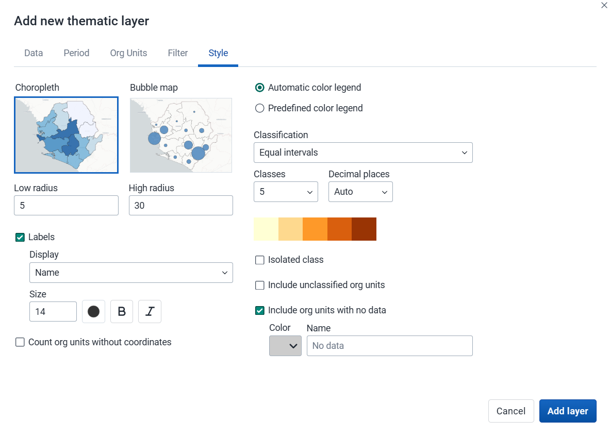

-   Select either **Choropleth** or **Bubble map**.

    -   A choropleth map assigns a color to each org unit shape according to the data value. This is
        the recommended technique if the data is normalized (per capita).

    -   A bubble map shows data values as proportional circles. Use this technique if the data is
        not normalized (absolute numbers). The circles are placed in the center of each org unit.
        Set the **Low radius** and **High radius** for the proportional circles. The circles will be
        scaled between low and high radius according to the data value. The radius must be between 0
        and 50 pixels.

-   **Show labels**: Show org unit names and/or values on the layer. Select **Name**, **Name and
    value**, or **Value**. Font size, weight, style and color can also be modified.

-   **Count org units without coordinates**: Org units without map coordinates are counted and shown
    in a **Data quality** section of the legend. They also appear in the data table.

-   Select the legend type:

    -   **Automatic color legend**: A legend is automatically created based on the classification
        method, number of classes and color scale you select. Set **Classification** to one of:

        -   _Equal intervals_: The range of each interval is (highest data value − lowest data
            value) / number of classes.
        -   _Equal counts_: Org units are distributed as evenly as possible across classes.
        -   _Natural breaks (intervals)_ and _Natural breaks (clusters)_: Class boundaries are
            placed at the largest gaps in the data distribution. Clusters may present gaps between
            classes where no values fall.
        -   _Pretty breaks_: Break points are rounded to clean, human-readable numbers.
        -   _Logarithmic scale_: Uses a logarithmic scale. Values must be positive; zero or negative
            values are left as unclassified.
        -   _Standard deviation_: Classes are defined as multiples of standard deviations from the
            mean. The number of standard deviations per class depends on the number of classes
            chosen; values further from the mean are left as unclassified.

        **Decimal places**: Number of decimal places shown in legend labels. **Auto** lets the app
        decide based on the data range, or choose a fixed value from **0** to **6** (also available
        for single color legends).

        **Isolated class**: Define a value range (min–max) with a fixed color and optional label.
        Org units in that range are shown separately and excluded from automatic classification.

    -   **Predefined color legend**: Select from the predefined legends.

    -   **Single color legend**: Select the color of the bubbles or circles. Only available for
        bubble maps.

-   **Include unclassified org units**: Org units whose values fall outside all classification
    ranges are shown with a configurable color and label (default: "Unclassified").

-   **Include org units with no data**: Org units with no data value are shown with a configurable
    color and label (default: "No data").

Click **Add layer**.

### Modify a thematic layer

1.  In the layer panel, click the edit (pencil) icon on the thematic layer card.

2.  Modify the settings on any of the tabs as desired.

3.  Click **Update layer**.

### Filter values in a thematic layer

Thematic layers have a **Show/hide data table** option that can be toggled on or off from the
thematic layer card.

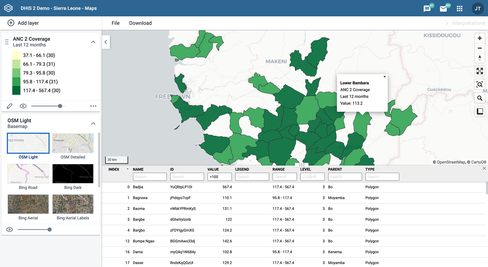

The data table displays the data associated with the thematic layer. Click the arrow buttons in a
column header to sort by that column. Type in the filter fields below each column header to filter
the displayed rows.

The name filter field is an effective way to search for individual org units.

For numeric columns, you can filter using comparison operators: `>`, `<`, `>=`, and `<=`. Use `,`
for OR logic and `&` for AND logic — for example: `2,>3&<8` matches the value 2 or any value greater
than 3 and less than 8.

> **Note**
>
> Data table filters are temporary and are not saved with the map.

### Open org unit profile

You can open the [org unit profile](#using_maps_org_unit_profile) in three ways:

1. Click an org unit on the map, then click the **View profile** button in the popup.

2. Right-click one of the org units on the map, and select **View profile** from the menu.

3. Click an org unit row in the **data table**.

### Navigate between org unit hierarchies

When there are visible org units on the map, you can easily navigate up and down in the hierarchy
without changing the org unit selection.

1.  Right-click one of the org units.

2.  Select **Drill up one level** or **Drill down one level**.

    The drill down option is disabled if you are on the lowest level or if there are no coordinates
    available on the level below. Likewise, the drill up option is disabled from the highest level.

### Remove a thematic layer

To remove a thematic layer from the map, in the layer card to the left, click the _more actions_
(three dots) icon and then click **Remove layer**.
## Manage event layers { #using_maps_event_layer }

The event layer displays the geographical location of events recorded in DHIS2 programs. When events
have associated point or polygon coordinates, you can drill down from aggregated data in thematic
layers to the underlying individual events or cases. Alternative coordinate fields also let you plot
events using locations other than the event itself, such as the org unit or enrollment location.

To display aggregated event statistics at the org unit level, use a thematic layer with event data
items instead.

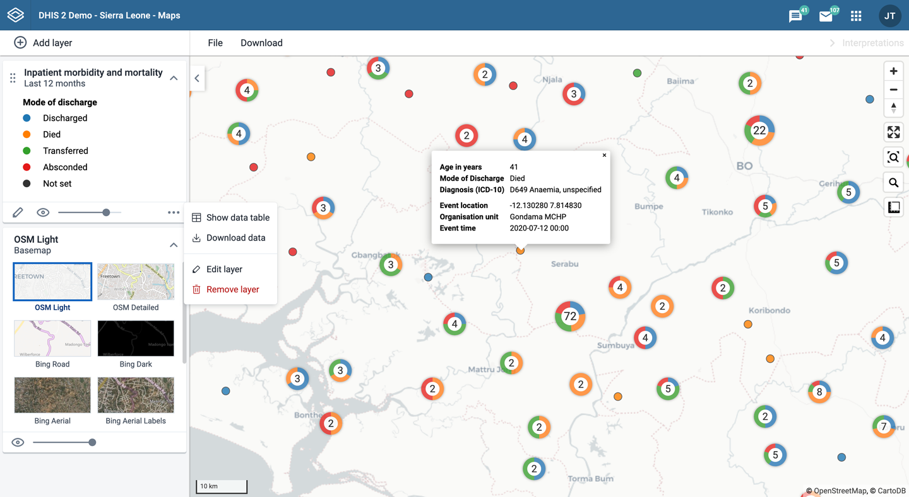

Event layers are represented by layer cards in the layer panel. The middle of the card shows a
legend indicating the styling of the layer. The more actions (three dots) button includes options to
show or hide the data table and to download the data in GeoJSON format.

### Create an event layer { #maps_create_event_layer }

To create an event layer, choose **Events** on the **Add layer** selection. This opens the Events
layer configuration dialog.

#### 1. Data

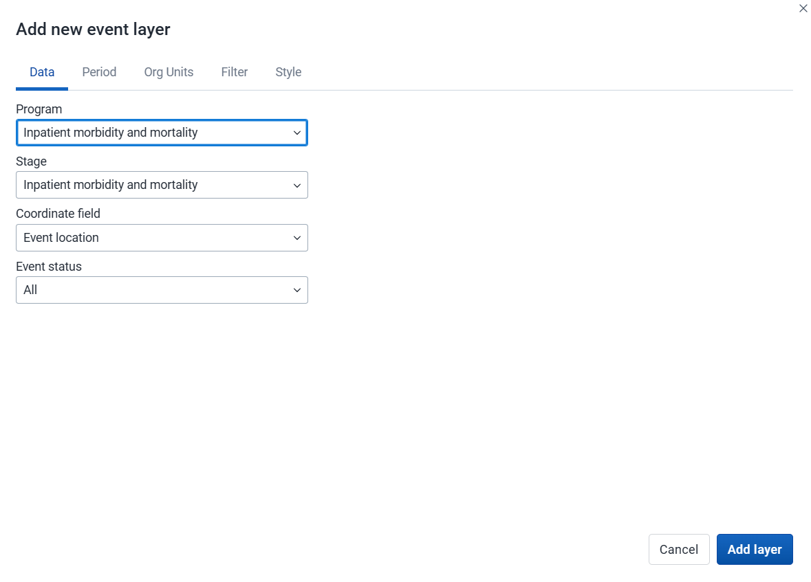

-   Select a program and then select a program stage. The **Stage** field is only shown once a
    program is selected.

    If there is only one stage available for the selected program, the stage is automatically
    selected.

-   Select a value from the **Coordinate field** to determine which positions are displayed on the
    map. By default, "Event location" is selected. You can also choose "Org unit location".
    Depending on the selected program, additional options may include "Tracked entity location",
    "Enrollment location", and coordinate or org unit type data elements or attributes, such as
    "Household location" or "Referral facility". The number of events represented on the map may
    vary depending on the selected option and the availability of coordinates. Org units are
    represented by their centroids.

-   By default, all events with coordinates are shown on the map. Use the **Event status** field to
    only show events having one status: Active, Completed, Schedule, Overdue, or Skipped.

#### 2. Period

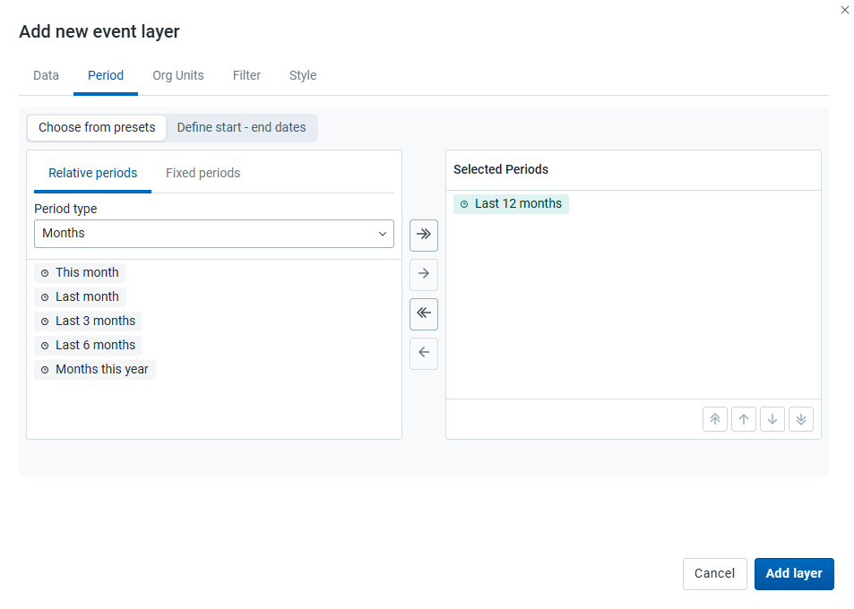

-   Select the time span for when the events took place. You can select either a fixed period or a
    relative period.

    -   _Relative period_: Select one of the relative periods, for example **This month** or **Last
        year**. A **default relative period for analysis** can be set in the **System Settings**
        app.

    -   _Fixed period_: Select **Start/end dates** and fill in a start date and an end date.

#### 3. Org units

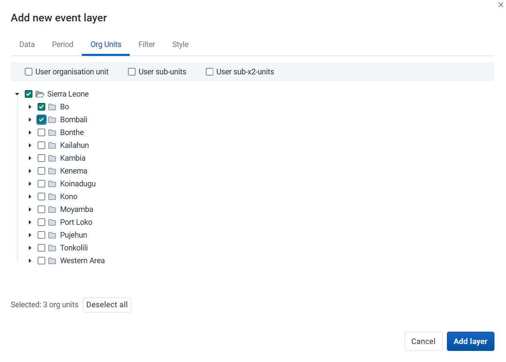

-   Select the org units you want to include in the layer. It is possible to select either

    -   One or more specific org units, or

    -   A relative level in the org unit hierarchy, with respect to the user. By selecting a **User
        org unit** the map data will appear differently for users at different levels in the org
        unit hierarchy.

#### 4. Filter

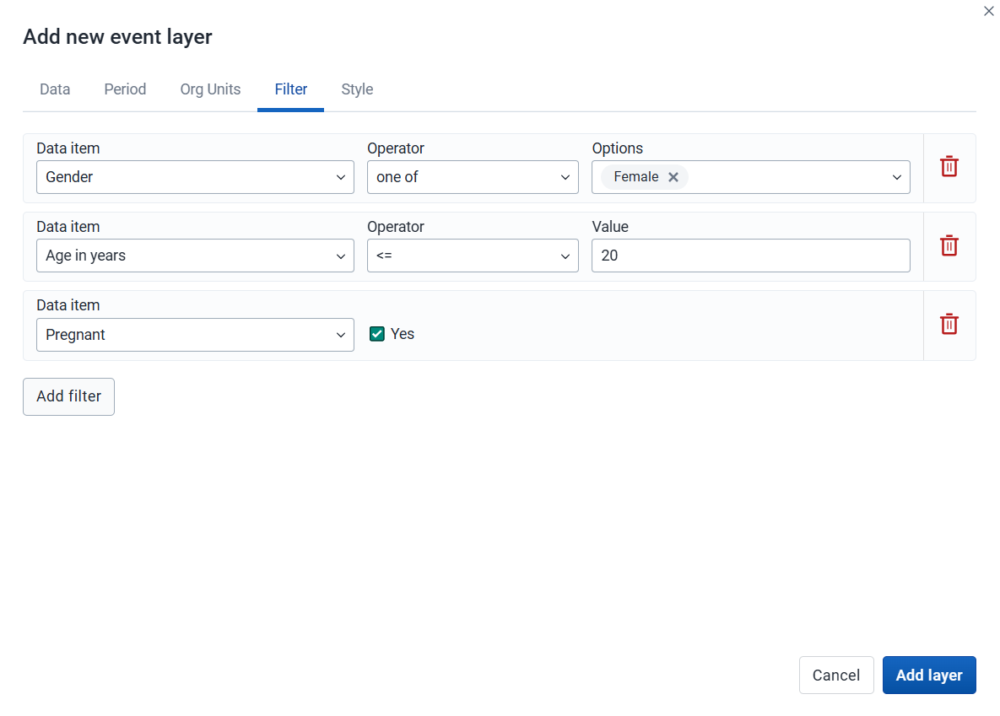

-   Click **Add filter** and select an available data item to add a new filter to the data set.

    -   For data item of type _option set_, you can select any of the options from the dropdown box,
        or type to filter.

    -   For data item of type _number_, you can select operators like equal, not equal, greater than
        or less than.

    -   For data item of type _boolean_ (yes/no), you can check the box if the condition should be
        true.

    -   For data item of type _text_, select **Contains** (matches any value containing the search
        text) or **Is exact** (matches only identical values).

    Multiple filters may be added. Click the trash button on the right of the filter to remove it.

#### 5. Style

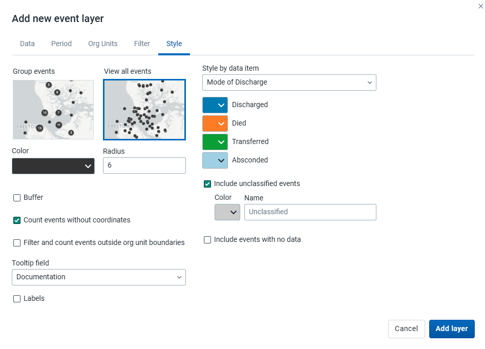

-   Select **Group events** to group nearby events (cluster), or **View all events** to display
    events individually.

    -   Select a **color** and **radius** (between 1 and 20) for the event or cluster points.

    -   Select **Show buffer** to display a visual buffer around each event. The radius of the
        buffer can be modified here. Only available when **View all events** is selected.

-   **Count events without coordinates**: Events without coordinates are counted and shown in a
    **Data quality** section of the legend. They also appear in the data table.

-   Select **Style by data item** (data element or attribute) to colorize the events according to a
    data value. If events are grouped, clusters are displayed as small donut charts showing the
    distribution of the data values. The available options vary for different data types:

    -   **Option sets**: Select a color for each option in an option set. You can set default colors
        for an option in the Maintenance app.

    -   **Numbers**: You can style a numeric data item in
        [the same way as thematic layers](#using_maps_thematic_layer_style) using automatic or
        predefined legends.

    -   **Booleans**: Select a color for true/yes and another for false/no.

    **Include unclassified events**: Events whose values fall outside all classification ranges are
    shown with a configurable color and label (default: "Unclassified").

    **Include events with no data**: Events with no data value are shown with a configurable color
    and label (default: "No data").

Click **Add layer**.

### Modify an event layer

1.  In the layer panel, click the edit (pencil) icon on the event layer card.

2.  Modify the settings on the **Data**, **Period**, **Filter**, **Org units** and **Style** tabs as
    desired.

3.  Click **Update layer**.

### Filter events

Event layers have a **Show/hide data table** option that can be toggled on or off from the event
layer card.

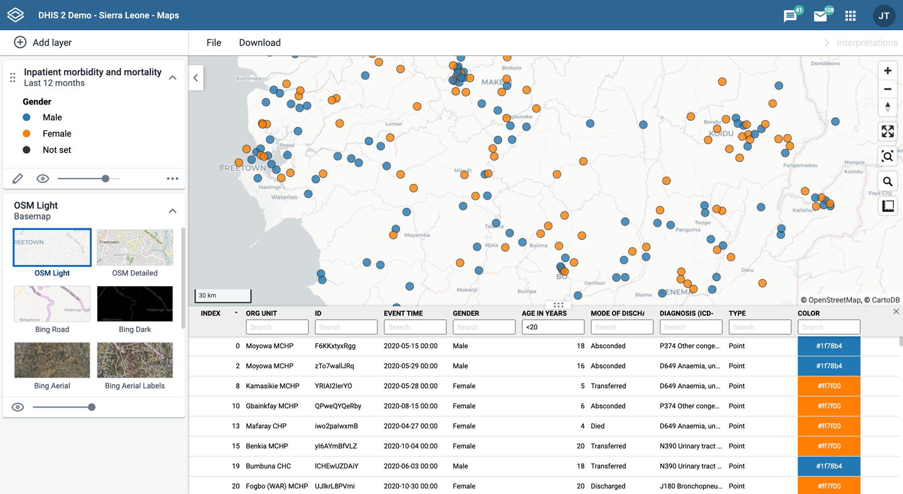

The data table displays the data associated with the event layer. Click the arrow buttons in a
column header to sort by that column. Type in the filter fields below each column header to filter
the displayed rows.

Additional columns appear for data elements configured to display in reports, and for any data item
used to style the events — both the data value and the color can be filtered in those columns.
Numeric columns support comparison operators: `>`, `<`, `>=`, and `<=`, with `,` for OR and `&` for
AND logic — for example: `2,>3&<8`.

> **Note**
>
> Data table filters are temporary and are not saved with the map.

### Modify information in event data table and popups

If you have access to the selected program in the Maintenance app, you can modify the information
displayed in the event popup window.

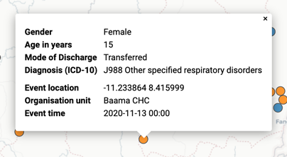

1.  Open the **Maintenance** app.

2.  Select **Program**.

3.  Click the program you want to modify and select **(2) Assign data elements**.

4.  For every data element you want to display in the popup window, select corresponding **Display
    in reports**.

5.  Click **Save**.

### Download raw event layer data

The raw data for event layers can be downloaded in GeoJSON format for more advanced geo-analytics
and processing in desktop GIS software such as [QGIS](https://www.qgis.org/). The downloaded data
includes all individual events as GeoJSON features, including attributes for each data element
selected for **Display in reports**.

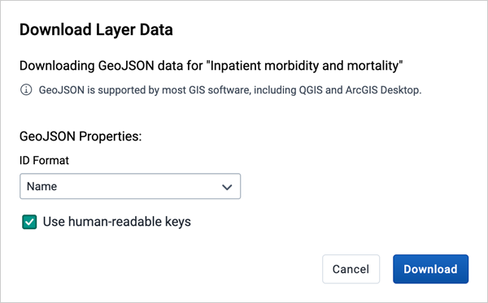

-   In the layer card to the left, click the _more actions_ (three dots) icon and then click
    **Download data**.

-   Select the **ID format** to use as the key for data element values in the downloaded GeoJSON
    file:

    -   **ID**: Use the unique ID of the data element.
    -   **Name**: Use the human-friendly name of the data element (translated).
    -   **Code**: Use the code of the data element.

-   Select whether or not to **Use human-readable keys** for other event attributes, such as Program
    Stage, Latitude, Longitude, Event Data, and Org Unit ID, Name, and Code. When this option is
    **not** selected, these values will be computer-friendly IDs instead of human-readable
    (translated) names.

-   Click the **Download** button to generate and download a GeoJSON file. The data will be
    requested from the DHIS2 server and processed by the maps application. This operation may take
    several minutes to complete.

-   Once the GeoJSON file has been downloaded, it can be imported into most standard GIS software.

> **Note**
>
> The downloaded data does not include style information as it is not natively supported by the
> GeoJSON format. Styles can optionally be recreated in external GIS applications using the
> attributes of each feature.

### Remove an event layer

To remove an event layer from the map, in the layer card to the left, click the _more actions_
(three dots) icon and then click **Remove layer**.
## Manage tracked entity layers { #using_maps_tracked_entity_layer }

The tracked entity layer displays the geographical location of tracked entities registered in DHIS2.
Tracked entities with associated point or polygon coordinates appear on the map.

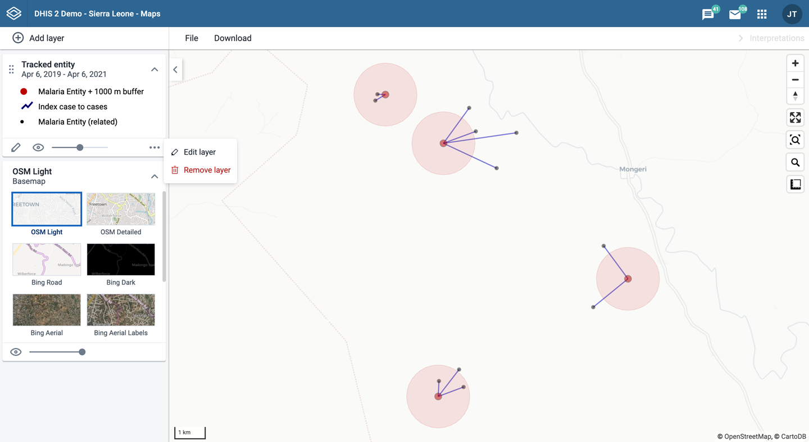

Tracked entity layers are represented by layer cards in the layer panel. The middle of the card
shows a legend indicating the styling of the layer.

### Create a tracked entity layer { #maps_create_tracked_entity_layer }

To create a tracked entity layer, choose **Tracked entities** on the **Add layer** selection. This
opens the Tracked entity layer configuration dialog.

#### 1. Data

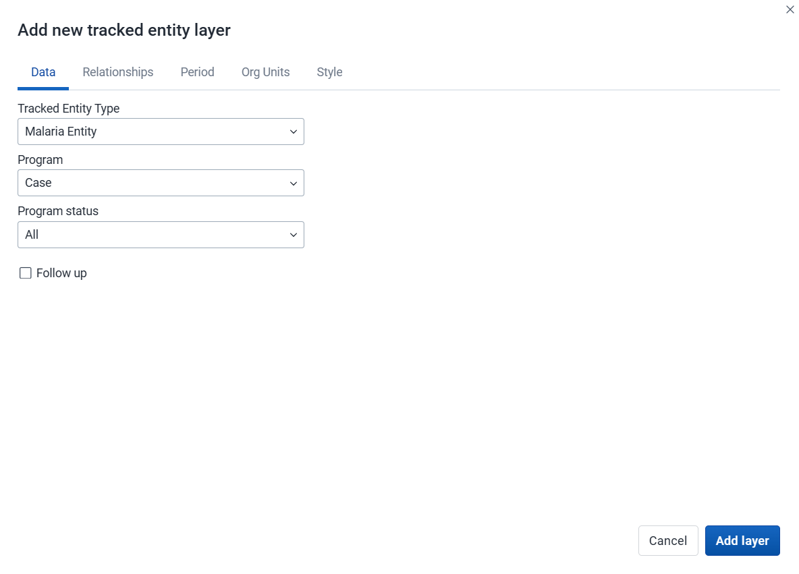

-   Select the **Tracked entity type** you want to show on the map.

-   Select a **Program** to filter tracked entities by enrollment.

-   Use the **Program status** field to select the enrollment status of tracked entities to include:
    All, Active, Completed, or Cancelled.

-   Filter by the **Follow-up** flag to include only tracked entities marked for follow-up.

#### 2. Relationships

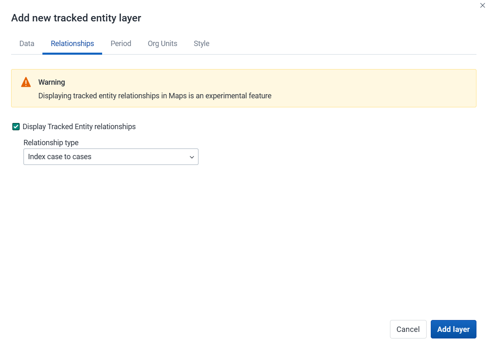

> **Caution**
>
> Displaying tracked entity relationships in Maps is an experimental feature.

-   Select the **Display tracked entity relationships** checkbox to show relationships on the map.

-   Select the **Relationship type** to display from the dropdown list. Only relationships defined
    for the selected tracked entity type are available.

#### 3. Period

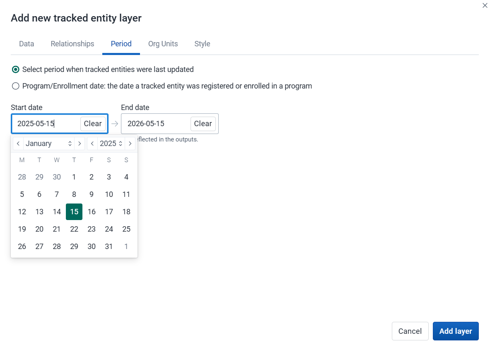

-   If no program is selected, you can set start and end dates for when the tracked entities were
    last updated.

-   If a program is selected, you can set the period when tracked entities were last updated or when
    they were enrolled in the program.

#### 4. Org units

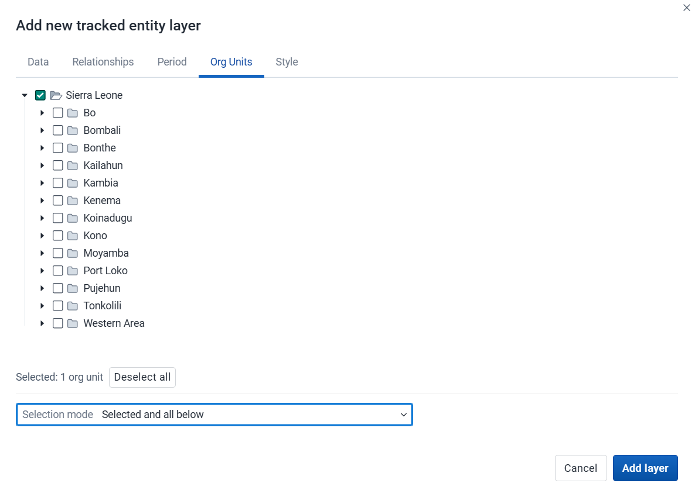

-   Select the org units you want to include in the layer. Three selection modes are available:

    -   **Selected only**: Include tracked entities belonging to selected org units only.

    -   **Selected and below**: Include tracked entities in and right below selected org units.

    -   **Selected and all below**: Include tracked entities in and all below selected org units.

#### 5. Style

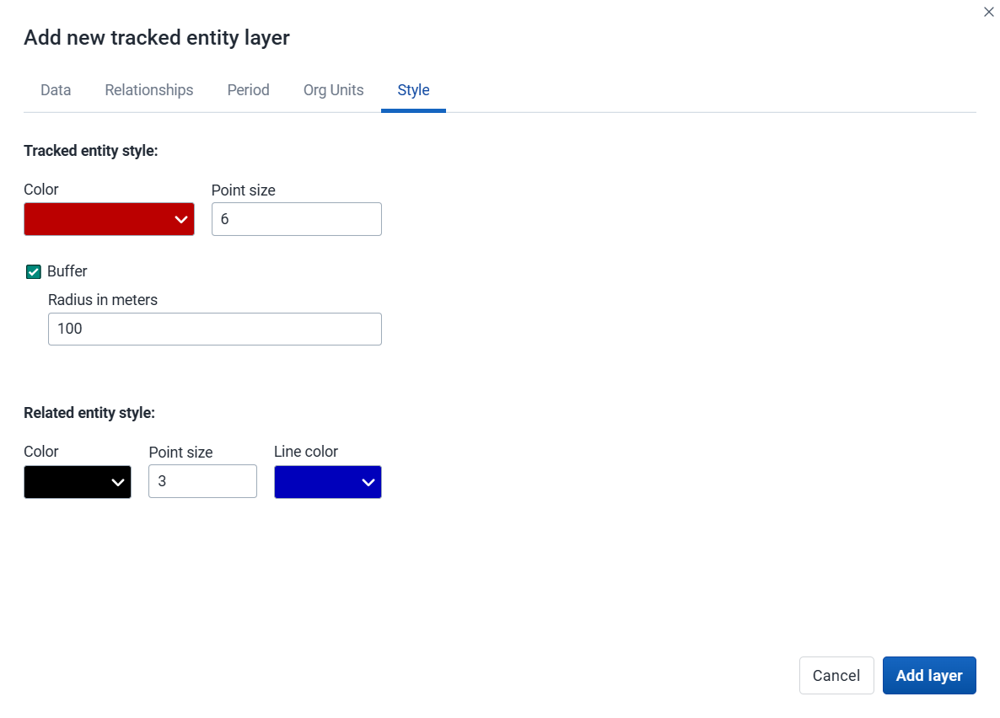

-   Select a **Color** for tracked entity points and polygons.

-   Select the **Point size** (radius between 1 and 20) for the points.

-   Select **Buffer** to display a visual buffer around each tracked entity. The buffer distance in
    meters can be modified here.

-   If a relationship type has been selected on the Relationships tab, you can select a **Color**
    and **Point size** for related tracked entities and a **Line color** for the relationship lines.

Click **Add layer**.

### Modify a tracked entity layer

1.  In the layer panel, click the edit (pencil) icon on the tracked entity layer card.

2.  Modify the settings on the **Data**, **Relationships**, **Period**, **Org units** and **Style**
    tabs as desired.

3.  Click **Update layer**.

### Modify information in tracked entity popups

If you have access to the selected program in the Maintenance app, you can modify the information
displayed in the tracked entity popup window.

1.  Open the **Maintenance** app.

2.  Select **Program**.

3.  Click the program you want to modify and select **(3) Attributes**.

4.  For every attribute you want to display in the popup window, enable **Display in list**.

5.  Click **Save**.

### Remove a tracked entity layer

To remove a tracked entity layer from the map, in the layer card to the left, click the _more
actions_ (three dots) icon and then click **Remove layer**.
## Manage facility layers { #using_maps_facility_layer }

The facility layer displays icons representing types of facilities. Only point-type org units are
shown - polygon org units such as districts or regions are not displayed.

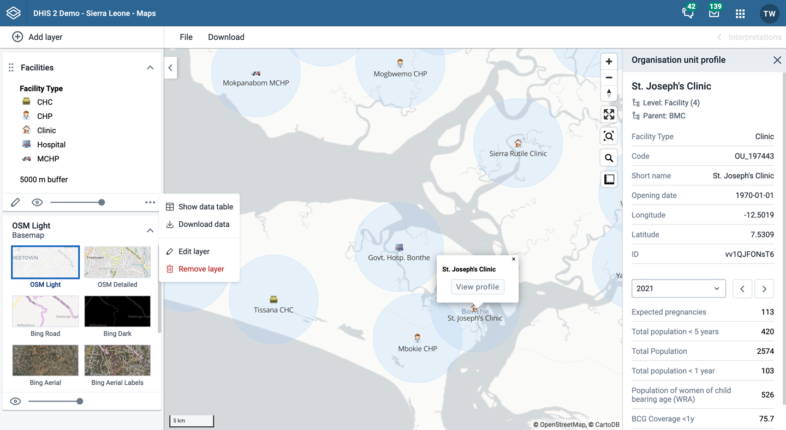

Facility layers are represented by layer cards in the layer panel. The middle of the card shows a
legend indicating the group set representation. The more actions (three dots) button includes
options to show or hide the data table and to download the data in GeoJSON format.

### Create a facility layer

To create a facility layer, choose **Facilities** on the **Add layer** selection. This opens the
Facility layer configuration dialog.

#### 1. Org units

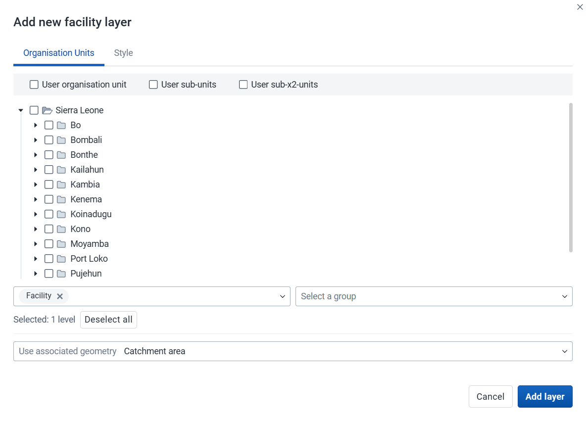

-   Select org unit levels and/or groups from the selection fields on the right-hand side.

-   Select the org units you want to include in the layer. It is possible to select either

    -   One or more specific org units, or

    -   A relative level in the org unit hierarchy, with respect to the user. By selecting a **User
        org unit** the map data will appear differently for users at different levels in the org
        unit hierarchy.

-   The system administrator can set the default org unit level containing facilities in the
    **System Settings** app.

-   **Use associated geometry**: This dropdown will only show if there are any additional geometries
    available for your org units. This is typically used to show facility catchment areas.

#### 2. Style

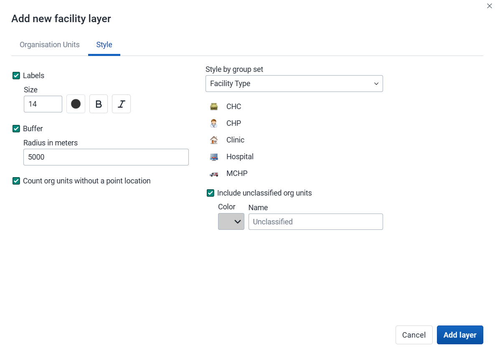

-   **Labels**: Allows labels to be shown on the layer. Font size, weight and color can be modified
    here.

-   **Buffer**: Displays a visual buffer around each facility. The radius of the buffer can be
    modified here. Not available if associated geometry is used.

-   **Count org units without a point location**: Org units without point coordinates are counted
    and shown in a **Data quality** section of the legend. They also appear in the data table.

-   Facilities can be styled with an **org unit group set** using different icons. Select a group
    set from the list of org unit group sets defined for your DHIS2 instance. The system
    administrator can set the default org unit group set in the **System Settings** app.

    **Include unclassified org units**: Org units not belonging to any group in the selected group
    set are shown with a configurable color and label (default: "Unclassified").

-   If no group set is selected, the facilities will be shown as filled circles. The color and
    radius can be changed.

Click **Add layer**.

### Modify a facility layer

1.  In the layer panel, click the edit (pencil) icon on the facility layer card.

2.  Modify the settings on the **Org units** and **Style** tabs as desired.

3.  Click **Update layer**.

### Filter values in a facility layer

Facility layers have a **Show/hide data table** option that can be toggled on or off from the
facility layer card.

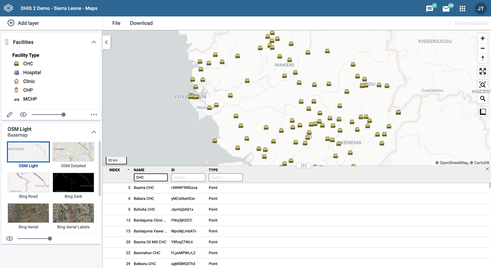

The data table displays the data associated with the facility layer. Click the arrow buttons in a
column header to sort by that column. Type in the filter fields below each column header to filter
the displayed rows. The name filter field is an effective way to search for individual facilities.

> **Note**
>
> Data table filters are temporary and are not saved with the map.

### Open org unit profile

You can open the [org unit profile](#using_maps_org_unit_profile) in three ways:

1. Click an org unit on the map, then click the **View profile** button in the popup.

2. Right-click one of the org units on the map, and select **View profile** from the menu.

3. Click an org unit row in the **data table**.

### Remove a facility layer

To remove a facility layer from the map, in the layer card to the left, click the _more actions_
(three dots) icon and then click **Remove layer**.
## Manage org unit layers { #using_maps_org_unit_layer }

The org unit layer displays the borders and locations of your org units. This layer is particularly
useful if you are offline and don't have access to background maps.

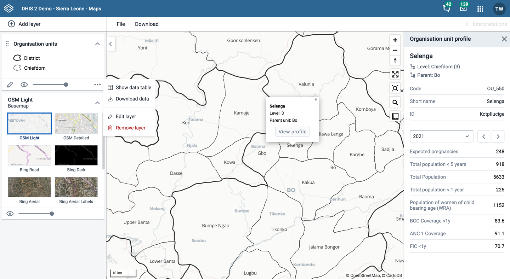

Org unit layers are represented by layer cards in the layer panel. The more actions (three dots)
button includes options to show or hide the data table and to download the data in GeoJSON format.

### Create an org unit layer

To create an org unit layer, choose **Org units** on the **Add layer** selection. This opens the Org
unit layer configuration dialog.

#### 1. Org units

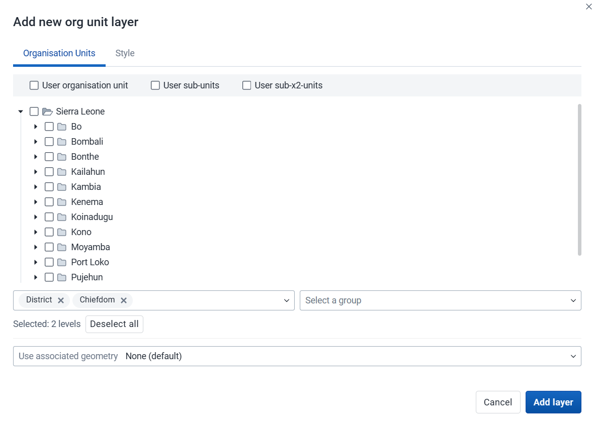

-   Select org unit levels and/or groups from the selection fields on the right-hand side.

-   Select the org units you want to include in the layer. It is possible to select either

    -   One or more specific org units, or

    -   A relative level in the org unit hierarchy, with respect to the user. By selecting a **User
        org unit** the map data will appear differently for users at different levels in the org
        unit hierarchy.

-   **Use associated geometry**: This dropdown will only show if there are any additional geometries
    available for your org units. This is typically used to show facility catchment areas.

#### 2. Style

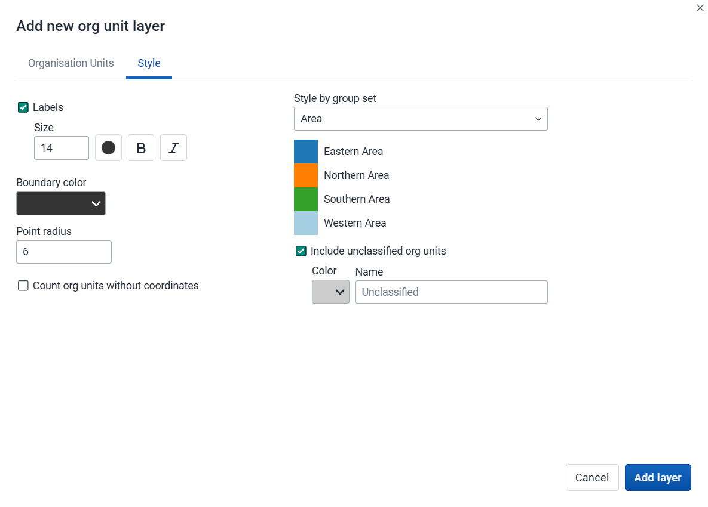

-   **Labels**: Allows labels to be shown on the layer. Font style can be modified here.

-   **Boundary color**: Allows the boundary or outline color of the org units to be changed.

-   **Point radius**: Sets the base radius when point type elements, such as facilities, are
    presented on the org unit layer.

-   **Count org units without coordinates**: Org units without coordinates are counted and shown in
    a **Data quality** section of the legend. They also appear in the data table.

-   Org units can be styled with an **org unit group set** using different colors. Select a group
    set from the list of org unit group sets defined for your DHIS2 instance.

    **Include unclassified org units**: Org units not belonging to any group in the selected group
    set are shown with a configurable color and label (default: "Unclassified").

Click **Add layer**.

### Modify an org unit layer

1.  In the layer panel, click the edit (pencil) icon on the org unit layer card.

2.  Modify the settings on the **Org units** and **Style** tabs as desired.

3.  Click **Update layer**.

### Filter values in an org unit layer

Org unit layers have a **Show/hide data table** option that can be toggled on or off from the org
unit layer card.

The data table displays the data associated with the org unit layer. Click the arrow buttons in a
column header to sort by that column. Type in the filter fields below each column header to filter
the displayed rows. The name filter field is an effective way to search for individual org units.

The level column supports numeric filtering using comparison operators: `>`, `<`, `>=`, and `<=`,
with `,` for OR and `&` for AND logic — for example: `2,>3&<8`.

> **Note**
>
> Data table filters are temporary and are not saved with the map.

### Open org unit profile

You can open the [org unit profile](#using_maps_org_unit_profile) in three ways:

1. Click an org unit on the map, then click the **View profile** button in the popup.

2. Right-click one of the org units on the map, and select **View profile** from the menu.

3. Click an org unit row in the **data table**.

### Navigate between org unit hierarchies

When there are visible org units on the map, you can navigate up and down in the hierarchy without
changing the org unit selection.

1.  Right-click one of the org units.

2.  Select **Drill up one level** or **Drill down one level**.

    The drill down option is disabled if you are on the lowest level. Likewise, the drill up option
    is disabled from the highest level.

### Remove an org unit layer

To remove an org unit layer from the map, in the layer card to the left, click the _more actions_
(three dots) icon and then click **Remove layer**.
## Manage Earth Engine layers { #using_maps_gee }

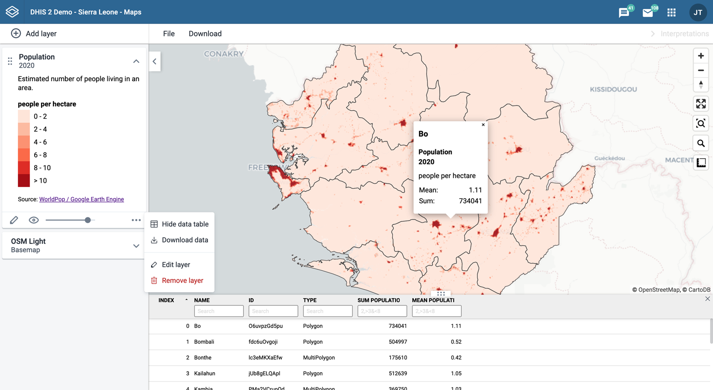

Google Earth Engine layers are enabled if a Google Earth Engine API key has been configured for your
system. Contact your system administrator if you need access to these layers.

The layers from Google Earth Engine let you display and aggregate external data for your org units.
Aggregated values can be viewed either in popups or in the data table.

Earth Engine layers are represented by layer cards in the layer panel. The more actions (three dots)
button includes an option to show or hide the data table.

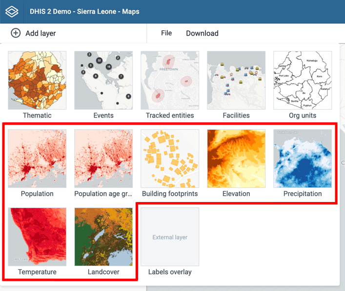

> **Note**
>
> The [**Maps app administrator**](#maps_app_administrator) can configure available layer sources.

The following layer sources are supported (sources marked with an asterisk "\*" are available by
default):

-   **Population (group)**: Detailed population data from WorldPop. Estimates are provided annually
    and include current, historical, and projected population values. Available between 2015
    and 2030.

    -   **Population** \*: Total population count.
    -   **Population age groups** \*: Population broken down by age and gender.

-   **Building footprints** \*: The outlines of buildings derived from high-resolution satellite
    imagery. Only for sub-Saharan Africa, South and Southeast Asia, Latin America and the Caribbean.

-   **Elevation** \*: Elevation above sea level.

-   **Heat stress (group)**: Universal Thermal Climate Index (UTCI), a measure of the thermal stress
    experienced by a person in a given environment. Available from 1950.

    -   **Heat stress daily**.
    -   **Heat stress weekly** (derived from daily dataset).
    -   **Heat stress monthly** (derived from daily dataset).

-   **Humidity (group)**: Relative humidity is the amount of water vapour present in air. Available
    from 1950.

    -   **Humidity daily**.
    -   **Humidity weekly** (derived from daily dataset).
    -   **Humidity monthly**.

-   **Precipitation (group)**: Accumulated water that falls to the surface. Combines model data with
    observations from across the world. Two sources are available:

    -   ERA5-Land. Available from 1950.
        -   **Precipitation daily**.
        -   **Precipitation weekly** (derived from daily dataset).
        -   **Precipitation monthly** \*.
    -   CHIRPS. Available from 1981.
        -   **Precipitation daily**.
        -   **Precipitation weekly** (derived from daily dataset).
        -   **Precipitation monthly** (derived from daily dataset).

-   **Temperature (group)**: Temperature at 2m above the surface. Combines model data with
    observations from across the world. Available from 1950.

    -   **Temperature daily**.
    -   **Temperature weekly** (derived from daily dataset).
    -   **Temperature monthly** \*.

-   **Land cover** \*: 17 distinct landcover types collected from satellites by NASA. Available
    yearly, between 2001 and 2022.

-   **Vegetation**: Normalized difference vegetation index (NDVI) and Enhanced Vegetation Index
    (EVI), used to quantify vegetation greenness. Collected from satellites by NASA. Available at
    16-day intervals, from 2000.
    -   **Vegetation 16-day**
    -   **Vegetation weekly** (derived from 16-day dataset).
    -   **Vegetation monthly** (derived from 16-day dataset).

### Create an Earth Engine layer

To create an Earth Engine layer, choose the desired layer from the **Add layer** selection. This
opens the layer configuration dialog.

#### 1. Data

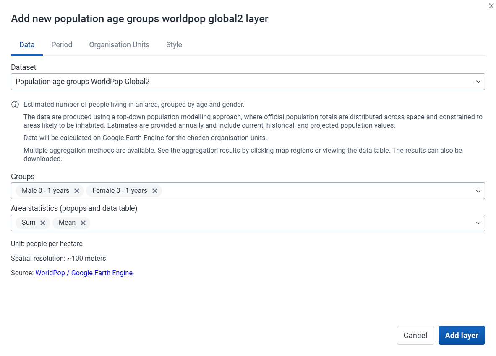

-   **Dataset** (if within a data group):

    -   For **Population** you can select either the **Population** or the **Population age group**
        dataset.

-   **Data subset**:

    -   For **Population age groups** you can select the age/gender **groups** you would like to
        include when aggregating the data.
    -   For **Temperature** or **Heat stress** you can select the **temporal aggregation method**
        you want to use (Mean, Min, Max).
    -   For **Vegetation** you can select the **index** you want to use (NDVI or EVI).

-   Select the **spatial aggregation methods** to use when calculating values for the selected org
    units. This only affects results in popups and the data table (some options might not be
    available depending on the layer source).

    -   **Sum**: Calculates the total number within each org unit. Recommended to use for the
        population layers.

    -   **Min**: Returns the minimum value in the layer unit displayed below the selection. For
        population layers it will be the minimum _people per hectare_. For the elevation layer it
        will return the lowest elevation (meters above sea level).

    -   **Max**: Returns the maximum value in the layer unit. For population layers it will be the
        maximum _people per hectare_. For the elevation layer it will return the highest elevation
        for each org unit.

    -   **Mean**: Returns the mean value in the layer unit. For population layers it will be the
        mean _people per hectare_. For the precipitation layer it will be the mean rainfall in
        millimeters across the org unit.

    -   **Median**: Returns the median value in the layer unit. For population layers it will be the
        median _people per hectare_. For the temperature layer it will be the median °C across the
        org unit.

    -   **Standard deviation**: Returns the standard deviation value in the layer unit.

    -   **Variance**: Returns the variance value in the layer unit.

    -   **Special cases**:
        -   For "building footprints": **Count**: Returns the number of buildings within each org
            unit. Note that building counts are only available for smaller org unit areas.
        -   For "landcover": **Percentage**, **Hectare**, **Acres**: Return the area covered by each
            landcover category within each org unit in different units.

#### 2. Period

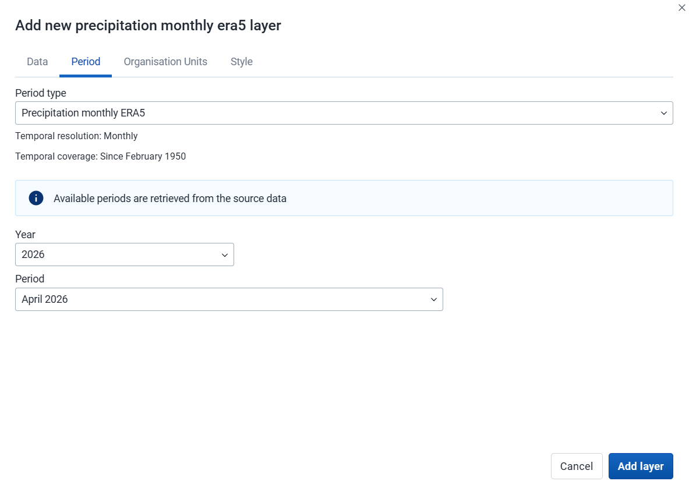

-   Select the period type (if multiple sources are enabled for **Heat stress**, **Precipitation**,
    **Temperature**, or **Vegetation**).

-   Select the period for the data source. The available periods are set by the layer source. Some
    sources are only available at a single point in time.

#### 3. Org units

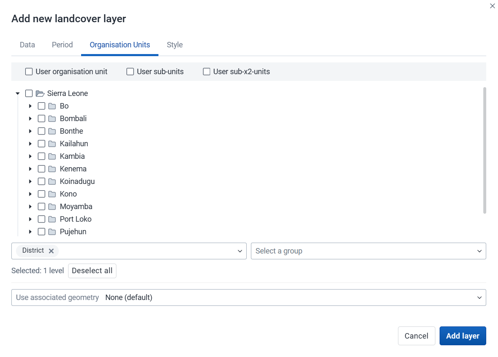

-   Select the org units where you want to see aggregated data values. It is possible to select
    either

    -   One or more specific org units, org unit levels in the hierarchy, org unit groups, or

    -   A relative level in the org unit hierarchy, with respect to the user. By selecting a **User
        org unit** the map data will appear differently for users at different levels in the org
        unit hierarchy.

-   **Use associated geometry**: This dropdown will only show if there are any additional geometries
    available for your org units. This is typically used to calculate values for facility catchment
    areas.

#### 4. Style

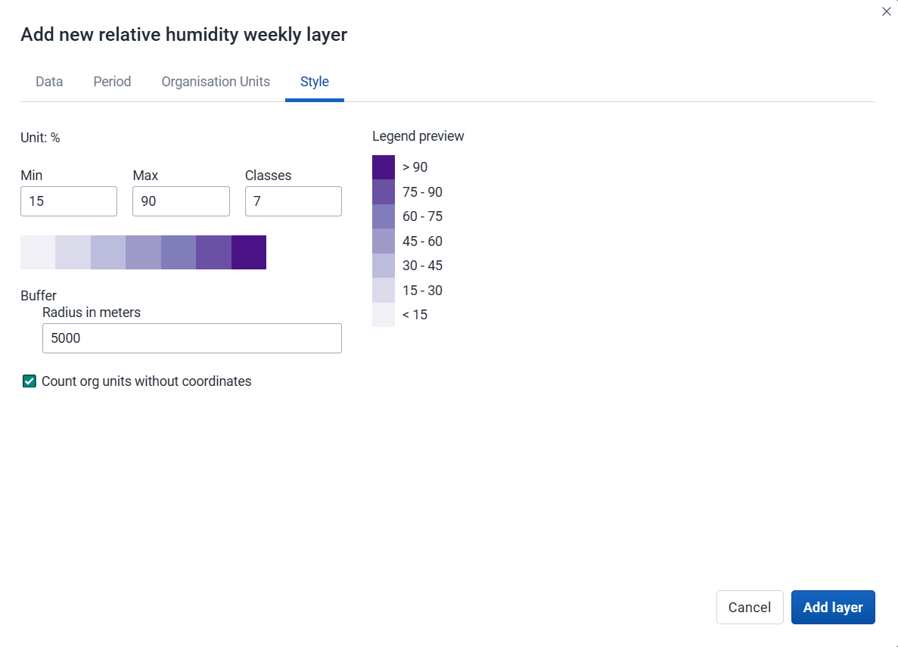

-   Adjust the legend **Min**, **Max**, number of **Classes**, and color map, as desired.

-   **Buffer**: If you select org units with a single point coordinate (facilities), you can set a
    radius buffer to calculate the data value within. A radius of 5000 meters will aggregate all
    values available within a 5 km distance from a facility. Buffer option is not available if
    associated geometry is used.

-   **Count org units without coordinates**: Org units without coordinates are counted and shown in
    a **Data quality** section of the legend. They also appear in the data table.

Click **Add layer**.

Click an org unit or facility on the map to see the aggregation result.

### Modify an Earth Engine layer

1.  In the layer panel, click the edit (pencil) icon on the Earth Engine layer card.

2.  Modify the settings on the **Data**, **Period**, **Org units**, and **Style** tabs as desired.

3.  Click **Update layer**.

### Filter values in an Earth Engine layer

Earth Engine layers have a **Show/hide data table** option that can be toggled on or off from the
layer card.

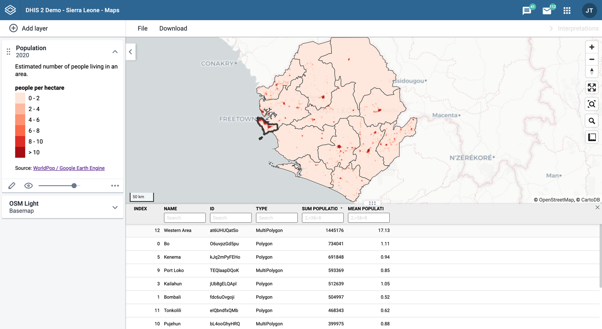

The data table displays all the aggregated values for the selected org units. Click the arrow
buttons in a column header to sort by that column. Type in the filter fields below each column
header to filter the displayed rows.

There is one column for each selected aggregation type. These numeric columns support comparison
operators: `>`, `<`, `>=`, and `<=`, with `,` for OR and `&` for AND logic — for example: `2,>3&<8`.

> **Note**
>
> Data table filters are temporary and are not saved with the map.

### Open org unit profile

You can open the [org unit profile](#using_maps_org_unit_profile) in three ways:

1. Click an org unit on the map, then click the **View profile** button in the popup.

2. Right-click one of the org units on the map, and select **View profile** from the menu.

3. Click an org unit row in the **data table**.

### Remove an Earth Engine layer

To remove an Earth Engine layer from the map, in the layer card to the left, click the _more
actions_ (three dots) icon and then click **Remove layer**.
## Add external map layers { #using_maps_external_map_layers }

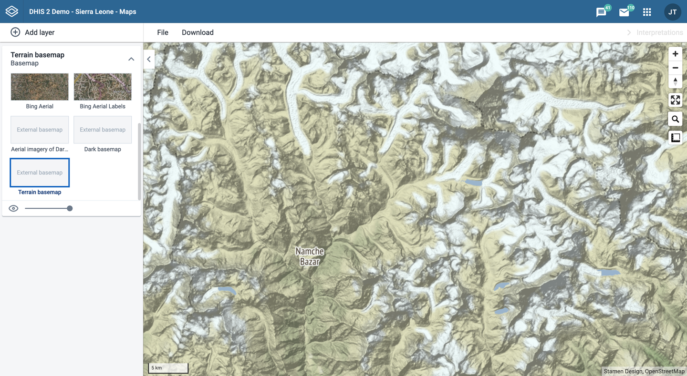

External map layers are represented as either basemaps or overlays.

> **Note**
>
> The [**Maps app administrator**](#maps_app_administrator) can add external map layers.

-   **Basemaps**

    These are available in the **basemap** card in the layers panel and are selected as any other
    basemap.

-   **Overlays**

    These are available in the **Add layer** selection. Unlike basemaps, overlays can be placed
    above or below any other overlay layers.

Overlay layers are represented by additional layer _cards_ in the layer panel.

Along the top of the overlay card from left to right are:

-   A grab field to allow dragging and re-ordering layers with the mouse

-   The title of the external map layer

-   An arrow symbol to collapse or expand the overlay card

In the middle of the card is a legend if the layer has one.

Along the bottom of the overlay card from left to right are:

-   A slider for modifying the layer transparency

-   A delete icon to remove the layer from the current map

### GeoJSON external layers

If you add a GeoJSON external layer to your map, you will have a few style choices:

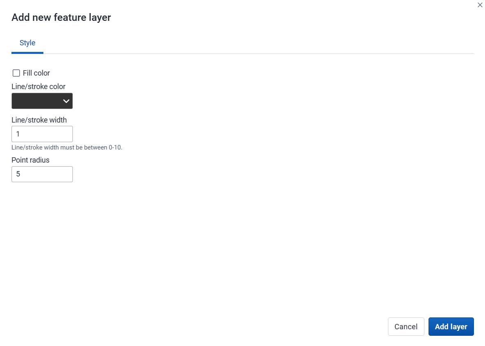

Once the GeoJSON layer is displayed, you can view its data table:

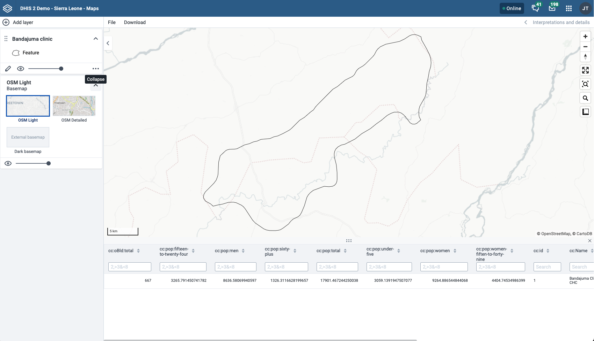

As with other layers, you can sort and filter the data. If you want to view the data for one row,
click the row to open the **Feature Profile**:

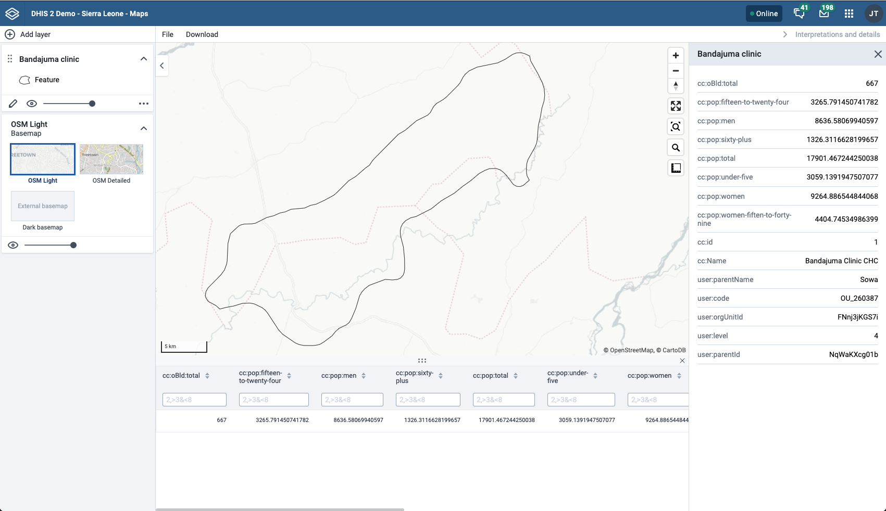
## Org unit profile { #using_maps_org_unit_profile }

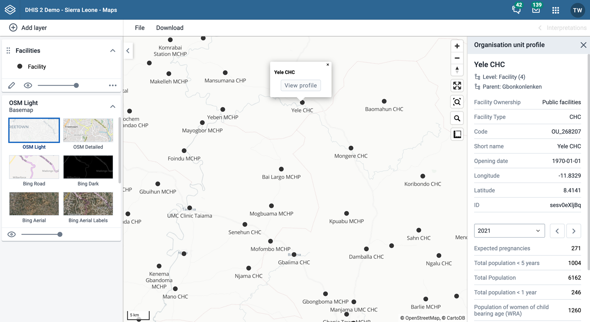

The org unit profile shows detailed information about each org unit. You can open the profile from
org unit layers, facility layers, thematic layers, and Earth Engine layers.

You can open the org unit profile in three ways:

1. Click an org unit on the map, then click the **View profile** button in the popup.

2. Right-click one of the org units on the map, and select **View profile** from the menu.

3. Click an org unit row in the **data table**.

The profile will show on the right side of the map. The profile content is set by the system
administrator.
## File menu { #using_maps_file_menu }

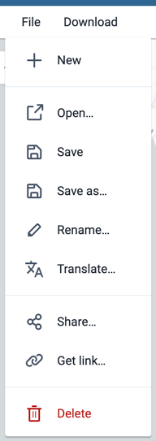

Use the **File menu** to manage your maps. Several menu items will be disabled until you open or
save a map.

Saving your maps makes it easy to restore them later. It also gives you the opportunity to share
them with other users as an interpretation or add them to a dashboard. You can save all types of
layer configurations as a saved map.

### Create a new map

Click **File** \> **New**.

> **Note**
>
> This will discard the current map without saving.

### Open a map

1.  Click **File** \> **Open**. A dialog box opens with a list of maps.

2.  Find the saved map you want to open. You can either use \< and \> or the search field to find a
    saved map. The list is filtered on every character that you enter. You can filter the list by
    selecting **Show all**, **Created by me** or **Created by others**.

3.  Click the name of the map you want to open.

### Save a map

When you have created a map it is convenient to save it for later use:

1.  Click **File** \> **Save**.

2.  Enter a **Name** (required) and a **Description** (optional) the first time you save a map.

3.  Click **Save**.

### Save a copy of a map

1.  Click **File** \> **Save as...**

2.  Enter a **Name** (required) and a **Description** (optional) for the map.

3.  Click **Save**.

### Rename a map

1.  Click **File** \> **Rename**.

2.  Enter a new **Name** and/or **Description** for your map.

3.  Click **Rename**. The map is updated.

### Translate a map

1.  Click **File** \> **Translate**.

2.  Select the **Locale** (language) for your translation.

3.  Enter a translated **Name** and **Description**. The original text will show below the field.

4.  Click **Save**.

### Modify sharing settings for a map

After you have created a map and saved it, you can share the map with everyone or a user group. To
modify the sharing settings:

1.  Click **File** \> **Share**. The sharing settings dialog opens.

2.  **Give access to a user or group**: In the text box, search for the name of the user or group
    you want to share your saved map with and select it.

    Select the access level and click **Give access**.

    Repeat the step to add more users or groups.

3.  **Users and groups that currently have access**: For each user or group, choose the access
    level. The options are:

    -   **No access**: The public won't have access to the map. This setting is only applicable to
        All users.

    -   **View only**: Users can view but not edit the map.

    -   **View and edit**: Users can view and edit the map.

    -   **Remove access**: Remove the access for groups or individuals.

4.  Click **Close** to close the dialog.

### Get the link to a map

1.  Click **File** \> **Get link**. A link dialog opens.

2.  Copy the link.

### Delete a map

1.  Click **File** \> **Delete**. A confirmation dialog is displayed.

2.  Click **Delete** to confirm that you want to delete the saved map. Your map is deleted and the
    layers are cleared from the view.
## Map interpretations and details { #mapsInterpretation }

An interpretation is a description of a map for a given period. This information is also visible in
the **Dashboard app**. Click **Interpretations and details** in the top right of the workspace to
open the interpretations panel. The button is only available when the map has been saved.

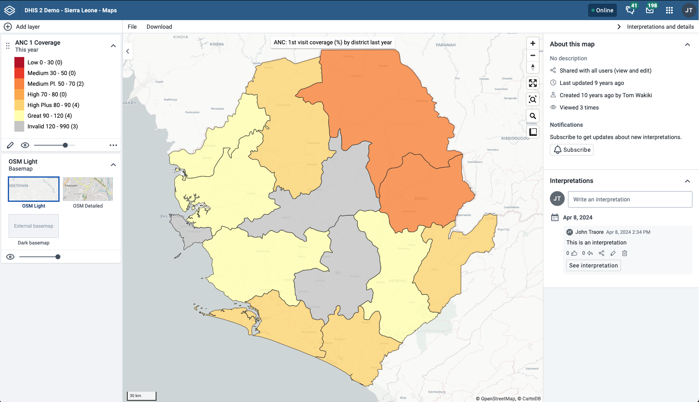

### View interpretations based on relative periods

To view interpretations for relative periods, such as a year ago:

1.  Open a saved map with interpretations.

2.  Click **Interpretations and details** in the top right of the workspace to open the
    interpretations panel.

3.  Click **See interpretation**. Your map displays the data and the date based on when the
    interpretation was created. To view other interpretations, click them.

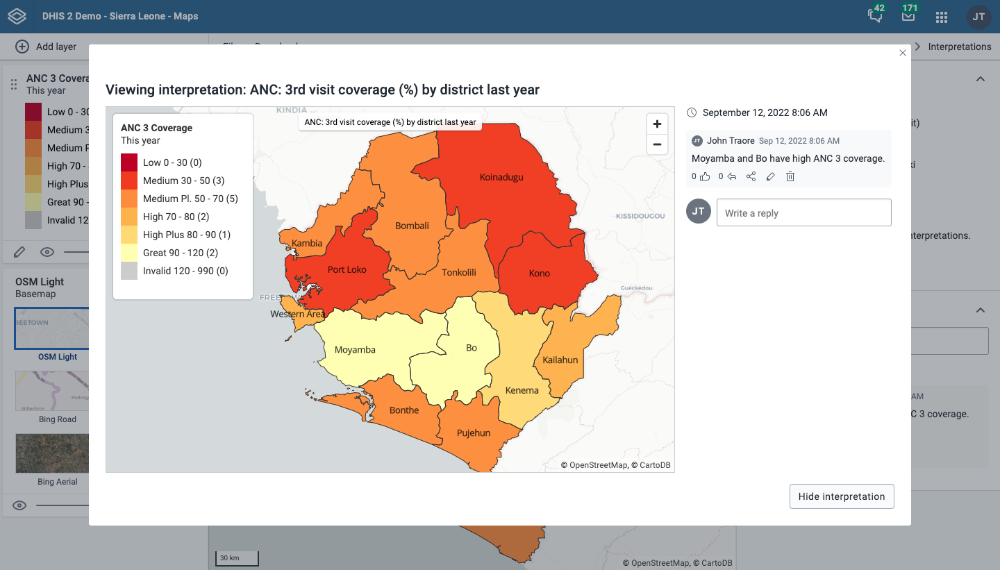

### Write interpretation for a map

To create an interpretation, you first need to create a map and save it. If you've shared your map
with other people, the interpretation you write is visible to those people.

1.  Open a saved map.

2.  Click **Interpretations and details** in the top right of the workspace to open the
    interpretations panel.

3.  A text field appears where you can write an interpretation.

4.  In the text field, type a comment, question or interpretation. You can also mention other users
    with '@username'. Start by typing '@' followed by the first letters of the username or real
    name, and a list of matching users will appear. Mentioned users will receive an internal DHIS2
    message with the interpretation or comment. You can see the interpretation in the **Dashboard
    app**.

5.  Click **Post interpretation** to save the interpretation.

### Change sharing settings for an interpretation

1.  Click an interpretation (see how to view an interpretation above).

2.  Click the share icon below the interpretation. The sharing settings dialog opens.

3.  Search for and add users and user groups that you want to share your map with, and set the
    access level. Click **Give access**.

4.  Change the access level for the users you want to modify:

    -   **No access**: The public won't have access to the map. This setting is only applicable to
        All users.

    -   **View only**: Users can view but not edit the map.

    -   **View and edit**: Users can view and edit the map.

    -   **Remove access**: Remove the access for groups or individuals.

5.  Click **Close** when sharing settings are updated.

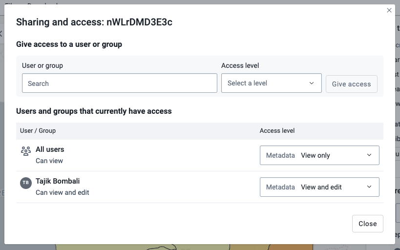
## Save a map as an image { #using_maps_image_export }

You can download your map as an image by clicking the **Download** button in the top menu.

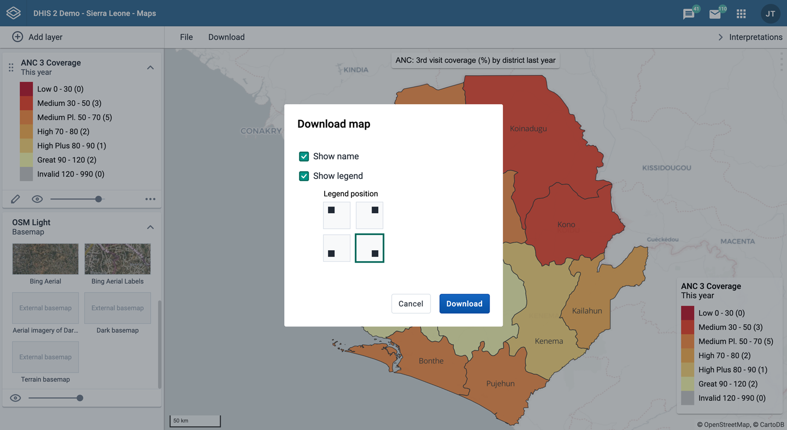

You will enter **Download mode** where you can adjust the map layout before you download the image.
The left column gives you the following options:

-   **Show map name**: Select if you want to include the map name or not. This option is only
    available if the map is saved. To change the name, exit download mode and select **File** \>
    **Rename**.
-   **Show map description**: Select if you want to include the map description or not. This option
    is only available if a map description was added when the map was saved. To change the map
    description, exit download mode and select **File** \> **Rename**.
-   **Show legend**: Select if you want to include the map legend. If the map includes more than one
    layer, you can select the visibility for each legend.
-   **Show overview map**: Select if you want to include an overview map (often named inset map).
    This option will be disabled if there is not enough room for it in the right column.
-   **Show north arrow**: Select to include a north arrow on the map. The default position is the
    lower right corner of the map, but you can change it to another corner.

Click **Download** to download your map.

Resize your browser window to change the map dimensions. You can also reposition both the main map
and the overview map.
## Search for a location { #using_maps_search }

The place search function allows you to search for almost any location or address. This is useful to
locate sites, facilities, villages or towns on the map.

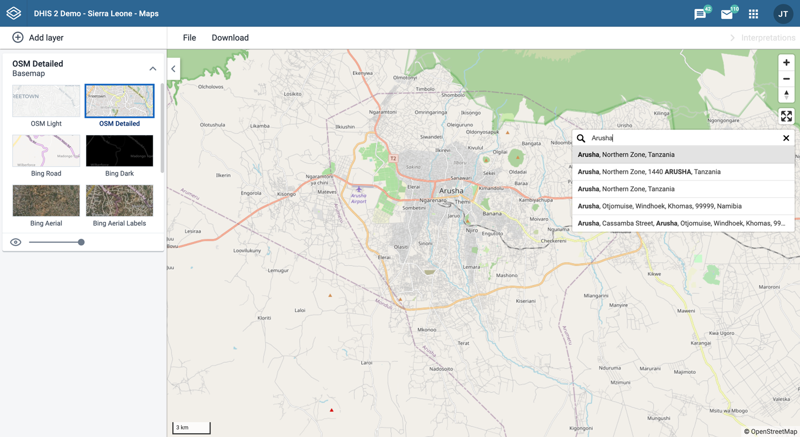

1.  On the right side of the Maps window, click the magnifier icon.

2.  Type the location you're looking for.

    A list of matching locations appear as you type.

3.  From the list, select a location. A pin indicates the location on the map.
## Measure distances and areas in a map { #using_maps_measure_distance }

1.  In the upper left part of the map, put the cursor on the **Measure distances and areas** (ruler)
    icon and click **Create new measurement**.

2.  Add points to the map.

3.  Click **Finish measurement**.

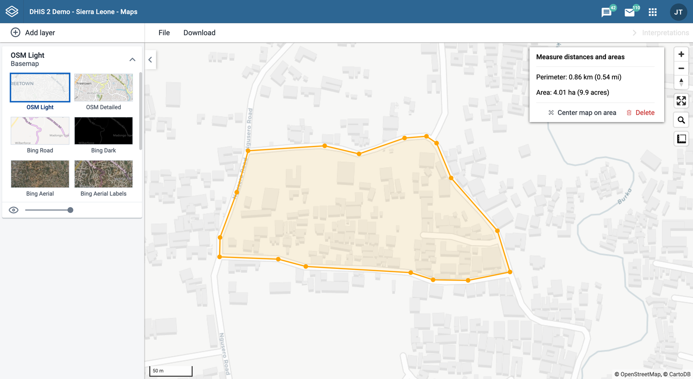
## Get the latitude and longitude at any location { #using_maps_latitude_longitude }

Right-click a point on the map and select **Show longitude/latitude**. The values are displayed in a
popup window.
## Maps app administrator { #maps_app_administrator }

A **Maps** app administrator can be defined by the system administrator assigning the
`F_EXTERNAL_MAP_LAYER_PUBLIC_ADD` authority.

The **Maps** app administrator is able to:

-   Select the sources for Google Earth Engine layers available to other users via the **Manage
    available layer sources** button.

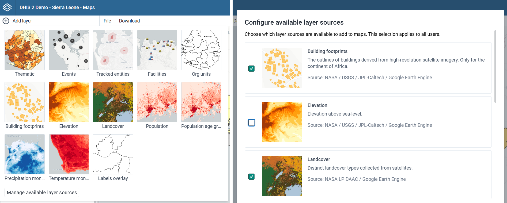

-   Add new external layer sources via the Maintenance app.

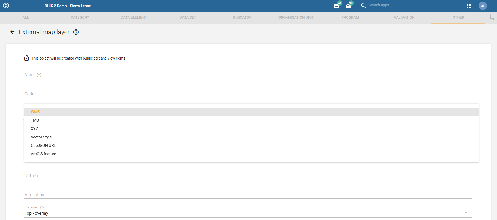
## See also

-   Configuration:

    -   [Configure DHIS2 Maps](https://docs.dhis2.org/en/use/user-guides/dhis-core-version-master/configuring-the-system/maps.html)
    -   [Accessing map layers from Google Earth Engine](https://docs.dhis2.org/en/topics/tutorials/google-earth-engine-sign-up.html#accessing-map-layers-from-google-earth-engine)
    -   [Geo-enabled microplanning](https://docs.dhis2.org/en/implement/health/immunization/immunization-campaigns/use.html?h=microplanning#geoenabled-microplanning),
        including details about facility catchment areas

-   Settings:

    -   [Infrastructural indicators / Infrastructural data elements / Infrastructural period type](https://docs.dhis2.org/en/use/user-guides/dhis-core-version-master/configuring-the-system/system-settings.html#system_server_settings:~:text=Infrastructural%20indicators)
    -   [Use centroids for organisation unit polygons in event analytics / Org unit group set in facility map layers / Org unit level in facility map layers / Default basemap](https://docs.dhis2.org/en/use/user-guides/dhis-core-version-master/configuring-the-system/system-settings.html#system_server_settings:~:text=Use%20centroids%20for%20organisation%20unit%20polygons%20in%20event%20analytics)
    -   [Google Maps / Bing / Azure API keys](https://docs.dhis2.org/en/use/user-guides/dhis-core-version-master/configuring-the-system/system-settings.html#system_server_settings:~:text=com/analytics.-,Google%20Maps%20API%20key,-Defines%20the%20API)

-   Metadata management:

    -   [Manage legends](https://docs.dhis2.org/master/en/user/html/manage_legend.html)
    -   [Aggregation operators](https://docs.dhis2.org/en/use/user-guides/dhis-core-version-master/configuring-the-system/metadata.html#create_data_element:~:text=Aggregation%20operators)

-   Training:
    -   [Trainer's Guide to Maps](https://docs.dhis2.org/en/topics/training-docs/analytics-tools-academy/maps/traineraposs-guide-to-maps.html)
    -   [Learner's Guide to Maps](https://docs.dhis2.org/en/topics/training-docs/analytics-tools-academy/maps/learneraposs-guide-to-maps.html)
